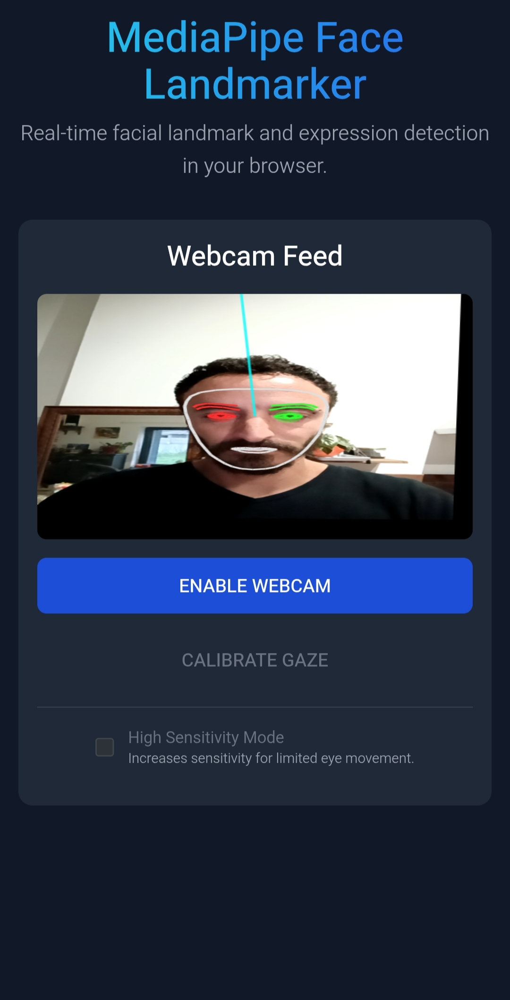

# Advanced Gaze Tracking with MediaPipe

> ⚠️ **Project Status:** This project is currently under active development.  
> I’m working on improving head pose compensation and fixing **parallax issues** 
---

## 🌐 [Try it here](https://webcam-eye-tracker.netlify.app/)

---

## 🧠 Overview

This is a sophisticated web application that transforms your webcam into a real-time eye tracker.  
Using advanced facial landmark detection, it allows you to control a cursor on the screen simply by moving your eyes.  
The project serves as a powerful demonstration of what's possible with modern computer vision in the browser.

---

## ✨ Features

- **Real-Time Gaze Tracking**: Utilizes a standard webcam to track eye movements with low latency.  
- **High-Accuracy Calibration**: A guided, multi-point calibration process creates a personalized profile for precise tracking.  
- **Advanced Head Pose Correction**: The system compensates for head rotations (tilting) and translations, ensuring the cursor follows your *gaze*, not just your head.  
- **Visual Feedback**: A smooth, glowing “gaze follower” provides immediate visual confirmation of the tracked point.  
- **High Sensitivity Mode**: Increases responsiveness, particularly useful for users with limited eye movement.  
- **Modern Tech Stack**: Built entirely with client-side technologies using React, TypeScript, and Google’s MediaPipe framework.  

---

## ⚙️ How It Works

1. **Face Landmark Detection**: Detects 478 key facial points in real time, focusing on eyes and irises.  
2. **Gaze Vector Calculation**: Computes gaze direction vectors from the iris to the eye center.  
3. **Head Pose Correction & Stabilization**: Uses MediaPipe’s 3D transformation matrix to remove head motion influence.  
4. **Calibration & Machine Learning**:
   - The user performs a 9-point calibration.
   - Data is fed into a **Ridge Regression** model that maps gaze vectors to screen coordinates.  
5. **Real-Time Prediction**: Continuously predicts the gaze position and moves the visual follower accordingly.

---

## 🚀 How to Use

1. Open the app in Chrome or Firefox.  
2. Allow camera access.  
3. Click **ENABLE WEBCAM** to start face tracking.  
4. Run **CALIBRATE GAZE** for best accuracy.  
5. Follow the 9-point calibration steps.  
6. Move your eyes to control the on-screen cursor.  

---

## 🛠️ Technology Stack

- **React** – UI framework  
- **TypeScript** – Type-safe development  
- **MediaPipe Face Landmarker** – Core face tracking  
- **Tailwind CSS** – Styling